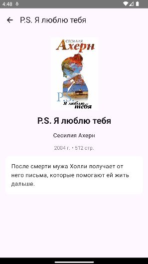

# Библиотека

## Описание

Приложение для просмотра книг из личной библиотеки. Содержит список книг и детальную информацию о каждой.

## Функциональность

- Список из 5 книг
- Обложки книг
- Экран с описанием
- Навигация между экранами

## Технологии

- Kotlin
- Jetpack Compose
- Navigation Compose
- Coil

## Скриншоты

| Главный экран                | Экран деталей |
|------------------------------|----------------|
| ) |  |

## Структура проекта
app/src/main/java/com/example/mylab/
├── MainActivity.kt
├── data/
│ └── Book.kt
├── navigation/
│ ├── Screen.kt
│ └── NavGraph.kt
└── ui/
├── HomeScreen.kt
├── DetailScreen.kt
└── theme/
├── Color.kt
├── Theme.kt
└── Type.kt

## Как запустить

1. Открыть проект в Android Studio
2. Подключить эмулятор или устройство
3. Нажать Run ▶️

## Автор

**Студент:** [Шумила Диана]
**Группа:** [ИСП-233]
